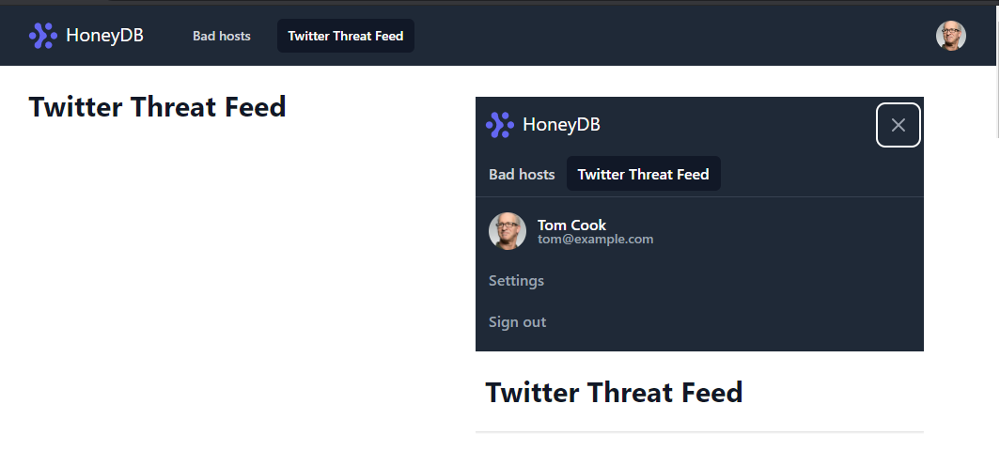
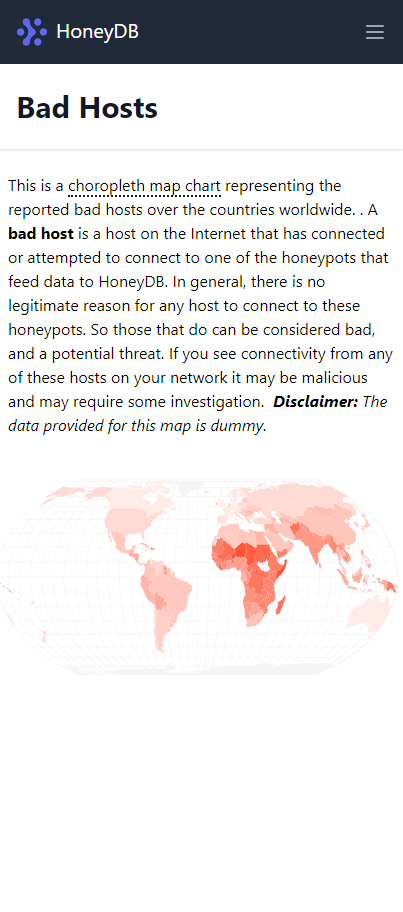
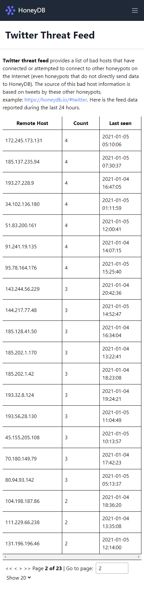

# HoneyDB Vulnerability Data Visualization

> ✨ Bootstrapped with Create Snowpack App (CSA).

Live URL: https://honeydb-viz.netlify.app/

## Tech stack:

- **snowpack** _to leverage modern web_
- **TypeScript** _for sane development_
- **Tailwind technologies** _as they are just awesome_
- **@reach/router** _for convenient, accssible routing_
- **react-query** _for server state management_
- **react-table** _for table management_
- **react-simple-maps** _for map viz_

## Why Snowpack?

Now, it's time for the modern web, where 95% of web traffic are from the modern web browsers that natively support [ESM](https://developer.mozilla.org/en-US/docs/Web/JavaScript/Guide/Modules).

I've chosen [**snowpack**](https://www.snowpack.dev/) instead of **create-react-app** to have a deep DX on the lightning-fast build, designed for the modern web. Snowpack is packed with rollup and [esbuild](https://github.com/evanw/esbuild) under the hood, which is 10-100x faster than other bundlers like webpack or parcel. 

On top of this, one thing made me excited and fascinated is the snowpack's experimental [**NO more NODE_MODULES**](https://www.snowpack.dev/posts/2020-12-03-snowpack-3-release-candidate) feature, which is about importing 3rd-party libraries directly from the Skypack CDN like [deno](https://deno.land/manual/linking_to_external_code).

Though it was challening (There's still a known [issue](https://github.com/anthowen/abuseip-viz/blob/main/src/utils/const.ts#L2)), but I really loved building all this from scratch, and it helped me gain great experiences with the modern web world.

## About HoneyDB

[HoneyDB](https://honeydb.io/about) provides real time data of honeypot activity. This data comes from honeypot sensors deployed globally on the Internet.

## Features

- [**Bad Hosts**](https://honeydb-viz.netlify.app/bad-hosts) page

  This page renders the zoomable map from the vulnerability csv data fetched from one of my other repo. (There is a description in the page)

- [**Twitter Threat Feed**](https://honeydb-viz.netlify.app/twitter-threats) page

  This page renders the IP list data in a paginated table format. (There is a description in the page)
  
- Declarative, reponsive menu bar
  (Dropdown menu is just a placeholder)

  

- Mobile-friendly website

  
  
  

## Tests

- Unit tests of **App**, **Header**, and **Navbar** components

- Integration test for **useTwThreatFeed** custom hook that feeds data into UI component

## Available Scripts

### yarn start

Runs the app in the development mode.
Open http://localhost:8080 to view it in the browser.

The page will reload if you make edits.
You will also see any lint errors in the console.

### yarn build

Builds a static copy of your site to the `build/` folder.
Your app is ready to be deployed!

**For the best production performance:** Add a build bundler plugin like "@snowpack/plugin-webpack" to your `snowpack.config.js` config file.

### yarn test

Goes through the Jest tests of the project.
Do `yarn test:watch` to run in interactive watch mode.
